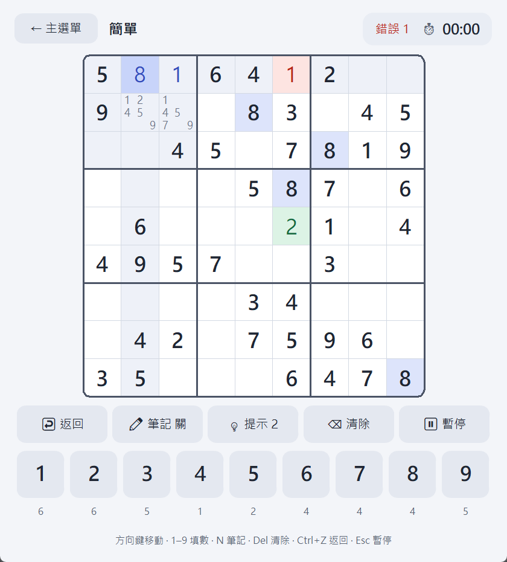

# 數獨（Sudoku）

現代扁平風格的 Python 桌面數獨遊戲（customtkinter），圓角按鈕與盤面、多種背景主題、自動存檔、每日挑戰與生涯統計。



## 功能

| 功能 | 說明 |
| --- | --- |
| 難度選擇 | 簡單 / 中等 / 困難 / 專家；依挖空格數與人類解題技巧（X-Wing、Swordfish…）出現頻率分級 |
| 題目生成 | 最小剩餘值（MRV）啟發法 + 回溯搜尋；於背景執行緒生成，畫面顯示「生成中…」不卡頓 |
| 計時器 | 開局自動計時，暫停 / 完成時停止 |
| 提示 | 每局 3 次，隨機填入一個正確格子（綠色），用完按鈕停用 |
| 錯誤標示 | 填錯立即顯示紅色並累計錯誤次數，改掉前持續標示 |
| 筆記模式 | ✏ 按鈕或 N 鍵切換；格內 3×3 小字顯示候選數，填入正式數字時自動清除同行 / 列 / 宮的相同筆記 |
| 高亮顯示 | 選取格、同行 / 列 / 宮、相同數字分層高亮 |
| 返回上一步 | ↩ 按鈕或 Ctrl+Z，可回復填數、清除、筆記、提示（含被自動清掉的筆記） |
| 暫停 | ⏸ 按鈕或 Escape，暫停時遮蔽盤面避免偷看 |
| 自動存檔 | 每次操作立即存檔、每秒計時節流存檔；關閉後重開可「繼續遊戲」 |
| 每日挑戰 | 以日期為種子，每天同一題，記錄 🔥 連續天數 |
| 遊玩紀錄 | 歷史清單，可依難度、完成 / 放棄、每日挑戰 / 一般篩選 |
| 生涯總覽 | 各難度局數、完成數、最佳 / 平均時間、零錯誤完成次數 |
| 背景主題 | 首頁 🎨 選擇 6 種主題（含 2 種深色），即時套用並記住設定 |

開新局時若有未完成的存檔，會先詢問確認，確認後舊局記為「放棄」。從遊戲中返回主選單不算放棄，存檔會保留。

## 安裝

需要 [uv](https://docs.astral.sh/uv/) 與 Python 3.12 以上。

```bash
uv sync
```

## 執行

```bash
uv run sudoku
# 或
uv run python -m sudoku.app
```

存檔與設定位於使用者資料目錄（`platformdirs.user_data_dir("sudoku")`，Windows 為 `%LOCALAPPDATA%\sudoku`）。

## 鍵盤快捷鍵

| 按鍵 | 行為 |
| --- | --- |
| 方向鍵 | 移動選取格（邊界不越界） |
| 1–9（含數字鍵台） | 填入數字；筆記模式下切換候選數 |
| Delete / Backspace | 清除格子 |
| N | 切換筆記模式 |
| Ctrl+Z | 返回上一步 |
| Escape | 暫停 / 繼續 |

滑鼠可直接點選格子與畫面下方的數字鍵盤（數字下方顯示剩餘數量，填滿 9 個後停用）。

## 專案結構

```
sudoku/
  app.py              # main() 進入點
  logic/              # 題目生成、解題器、人類技巧難度評級、提示
  data/               # GameState / GameRecord、Storage（存檔、紀錄、每日挑戰、設定）
  theme/              # Theme 設計 token 與內建主題
  ui/
    controller.py     # GameController：遊戲狀態邏輯（不依賴 tkinter，可單元測試）
    app_window.py     # SudokuApp 主視窗：畫面切換、開局 / 結算流程、背景生成
    menu_view.py      # 主選單
    game_view.py      # 遊戲畫面（頂部資訊列、功能列、數字鍵盤、結算）
    board_canvas.py   # Canvas 自繪盤面
    records_view.py   # 遊玩紀錄
    career_view.py    # 生涯總覽
    theme_picker.py   # 🎨 主題選單
    widgets.py        # 共用主題化元件
tests/                # pytest 測試
docs/
  interfaces.md       # 模組介面合約
  ui_screenshot.py    # 自動啟動 App 並截圖各畫面
  screenshots/        # 截圖輸出
```

## 測試

```bash
PYTHONUTF8=1 uv run pytest -q
```

產生畫面截圖（使用暫存目錄存檔，不影響真實資料）：

```bash
PYTHONUTF8=1 uv run python docs/ui_screenshot.py
```
